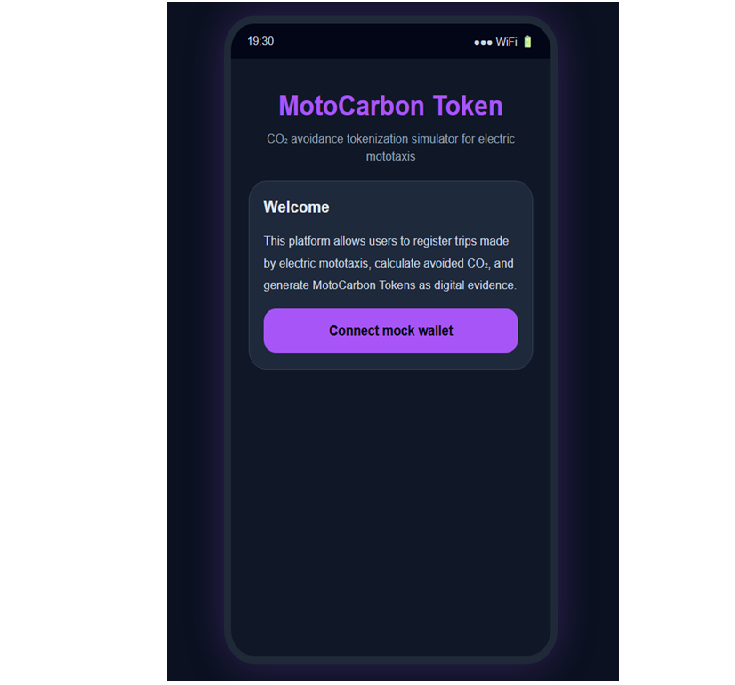

# MotoCarbon Token

## Final Project – Carbon Tokenization Hackathon

### National University of San Marcos (UNMSM)

---

# Project Information

**Course:** Microeconomics

**Academic Program:** Industrial Engineering

**Professor:** Lillo

---

# Team Members

- Renzo Yair Cubas Gil
- Jimmy Mendez Mosquera
- Michaell Pool Santiago Leon

---

# Project Description

MotoCarbon Token is a Blockchain-based solution designed to record the positive environmental impact generated by electric mototaxis through the tokenization of avoided CO₂ emissions.

Each completed trip stores relevant information such as the driver, district, traveled distance, avoided CO₂ emissions, and the amount of MotoCarbon Tokens generated. This information is associated with a Solidity Smart Contract, ensuring transparency, traceability, and data integrity.

The project consists of two complementary components. During the first stage, a Python-based simulation was developed to validate the CO₂ emission calculations, token generation process, and environmental impact analysis through reports and charts.

In the final stage, an interactive web application was developed to demonstrate the complete system. The platform allows users to connect a simulated wallet, register electric vehicle trips, automatically calculate avoided CO₂ emissions, generate MotoCarbon Tokens (MCT), and visualize transaction history in a simulated blockchain environment.

---

# Project Objective

Design a Blockchain-based system that promotes sustainable urban mobility by rewarding electric mototaxi drivers with environmental tokens based on their contribution to reducing carbon emissions.

---

# Technologies Used

- Solidity
- Hardhat
- Ethereum (Remix IDE)
- Python
- Pandas
- Matplotlib
- HTML5
- CSS3
- JavaScript
- Git
- GitHub

---

# Project Structure

```text
MotoCarbon-Token/
│
├── contracts/
│   └── MotoCarbonToken.sol
│
├── scripts/
│   └── deploy.js
│
├── python-simulation/
│   ├── MotoCarbonSimulation.py
│   └── motocarbon token.png
│
├── web-app/
│   ├── index.html
│   └── app-preview.png
│
├── package.json
├── hardhat.config.js
├── .gitignore
└── README.md
```

---

# Smart Contract

The Solidity Smart Contract provides the following functionalities:

- Register electric mototaxi trips.
- Store driver information.
- Register the operating district.
- Calculate avoided CO₂ emissions.
- Generate MotoCarbon Tokens.
- Retrieve registered trip records.
- Emit blockchain events to ensure transaction traceability.

---

# Python Simulation

As an initial validation stage, a Python simulation was developed using **Pandas** and **Matplotlib**.

The simulation performs the following tasks:

- Processes simulated electric mototaxi trips.
- Calculates avoided CO₂ emissions automatically.
- Generates MotoCarbon Tokens based on environmental impact.
- Produces reports grouped by driver and district.
- Creates charts to visualize environmental performance.

---

# Web Application

The web application was developed using **HTML5**, **CSS3**, and **JavaScript** as the final demonstration of the MotoCarbon Token platform.

Main features include:

- Simulated wallet connection.
- Electric trip registration.
- Automatic CO₂ emission calculation.
- MotoCarbon Token (MCT) generation.
- Blockchain transaction history visualization.
- Dashboard displaying environmental impact metrics.

---

# System Workflow

1. The user connects a simulated wallet.
2. An electric vehicle trip is registered.
3. The system calculates the avoided CO₂ emissions compared to a conventional gasoline-powered mototaxi.
4. MotoCarbon Tokens are generated based on the environmental impact achieved.
5. The trip is recorded in a simulated blockchain transaction history.

---

# System Architecture

```text
Electric Mototaxi
        │
        ▼
Trip Registration
        │
        ▼
CO₂ Emission Calculation
        │
        ▼
MotoCarbon Token Generation
        │
        ▼
Simulated Blockchain Record
```

---

# Future Improvements

- MetaMask integration.
- Smart Contract deployment on an EVM-compatible network.
- LACChain integration.
- IPFS support for decentralized evidence storage.
- Mobile application development.
- Administrative dashboard for municipalities and transportation associations.

---

# Repository

This repository contains the Solidity Smart Contract, a Python-based analytical simulation, and an interactive web application demonstrating the MotoCarbon Token platform for environmental tokenization through electric mototaxi operations.

---

# Web Application Preview

The following image presents the interactive prototype developed for the MotoCarbon Token platform.



The web application simulates wallet connection, electric trip registration, CO₂ emission reduction calculation, MotoCarbon Token generation, and blockchain transaction history visualization.

---

# Authors

**Carbon Mobility Team**

National University of San Marcos (UNMSM)

The project includes a web prototype that simulates the interaction with the MotoCarbon Token platform.


The web application simulates wallet connection, electric trip registration, CO₂ avoidance calculation, MotoCarbon Token generation, and blockchain transaction history visualization.
